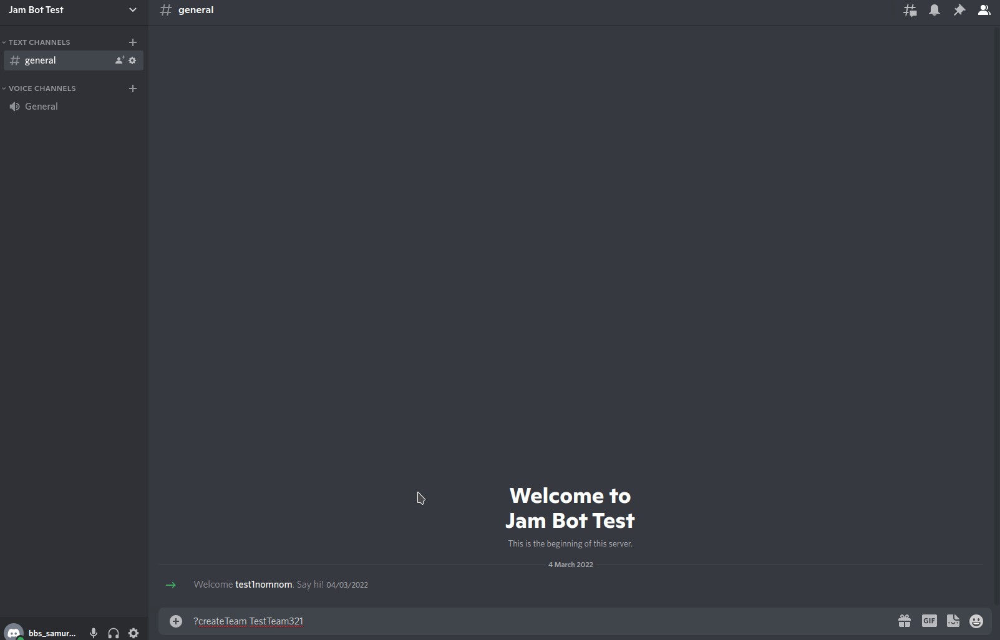

## Jam Bot
A Discord bot that can manage team voice and text channels without an external database. 

* Each team will be given their own role and only they can see their team channels.
* Teams can be locked, blocking other people trying to join.
* Locked teams can be unlocked allowing other people to join.
* Doesn't need an external database.

You can get the command list by typing ``?help``

You need to have a file called .env next to jam.py with your bot token in it.

An example .env file is in the repository with the name .env.example you can just substitute your bot token in it and rename it .env

##### To install required package:

``python3 -m pip install -U discord.py python-dotenv``

##### To run the bot :

``python3 jam.py``

